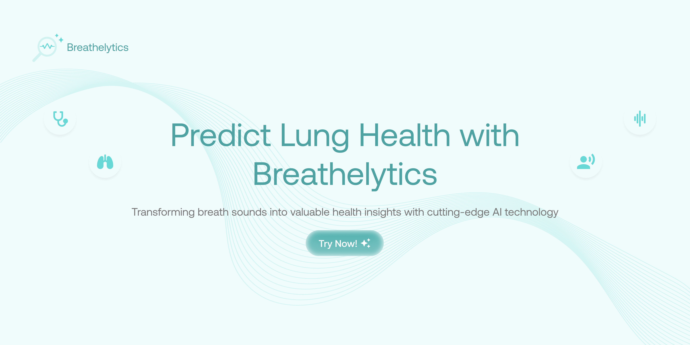

# `breathelytics`

**AI-Powered Respiratory Disease Detection Platform**


Breathelytics is a web-based platform that leverages advanced machine learning to analyze respiratory sounds and detect potential lung diseases. Using AI-powered audio analysis, the platform provides instant health insights from simple breathing or cough recordings.

---

## Team

| **Student ID** | **Name**                    | **Role**                                 |
| -------------- | --------------------------- | -----------------------------------------|
| 103052300001   | Muhammad Karov Ardava Barus | Lead, AI/ML Engineer (Hacker)            |
| 103052300025   | Vadly Aryu Septian          | AI/ML Engineer (Hacker)                  |
| 101012330102   | Akhmad Muzakkii             | AI/ML Engineer (Hacker)                  |
| 102022330303   | Casta Garneta               | UI/UX Designer (Hipster)                 |
| 1401223418     | Amira Nida Nisrina          | Business Lead & Presenter (Hustler)      |

---

## Features

- **🎤 Audio Upload & Analysis**: Upload respiratory audio files (WAV, MP3, M4A, FLAC) for instant AI analysis
- **🧠 AI-Powered Disease Detection**: Advanced machine learning model trained to detect 8 respiratory conditions:
  - Healthy (Normal)
  - Pneumonia
  - Bronchiolitis  
  - Bronchiectasis
  - COPD (Chronic Obstructive Pulmonary Disease)
  - URTI (Upper Respiratory Tract Infection)
  - LRTI (Lower Respiratory Tract Infection)
  - Asthma
- **📊 Confidence Scoring**: Provides confidence levels and detailed probability distributions
- **📋 Comprehensive Reports**: Generate downloadable analysis reports with recommendations
- **🎨 Modern UI/UX**: Clean, responsive interface with real-time progress tracking
- **⚡ Real-time Processing**: Fast analysis with live progress updates
- **🔒 Secure File Handling**: Temporary file processing with automatic cleanup

---

## Architecture

### Backend (Flask API)
- **Framework**: Python Flask with Flask-CORS
- **ML Pipeline**: Custom respiratory disease classification model
- **Audio Processing**: Librosa for feature extraction
- **File Handling**: Secure upload validation and temporary storage
- **API Endpoints**:
  - `GET /health` - Health check
  - `POST /predict` - Main prediction endpoint
  - `GET /diseases` - Disease information
  - `GET /pipeline-status` - Model status

### Frontend (Vanilla JavaScript)
- **Technology**: Pure JavaScript, HTML5, CSS3
- **Design**: Modern responsive UI with CSS Grid/Flexbox
- **Features**: 
  - Drag & drop file upload
  - Real-time progress tracking
  - Dynamic results visualization
  - Disease-specific UI themes
  - Mobile-responsive design

---

## Setup & Installation

### Prerequisites
- Python 3.10+ 
- Node.js (optional, for development server)
- Modern web browser

### Backend Setup

1. **Navigate to backend directory**:
   ```bash
   cd src/breathelytics-backend
   ```

2. **Create and activate virtual environment**:
   ```bash
   python -m venv .venv
   
   # On Windows:
   .venv\Scripts\activate
   
   # On macOS/Linux:
   source .venv/bin/activate
   ```

3. **Install dependencies**:
   ```bash
   pip install -r requirements.txt
   ```

4. **Set environment variables** (optional):
   ```bash
   # Create .env file or set directly
   export FLASK_ENV=development
   export FLASK_DEBUG=True
   ```

5. **Run the Flask server**:
   ```bash
   python app.py
   ```
   
   The backend will start at `http://127.0.0.1:5000`

### Frontend Setup

1. **Navigate to frontend directory**:
   ```bash
   cd src/breathelytics-frontend
   ```

2. **Option 1: Simple HTTP Server (Python)**:
   ```bash
   python -m http.server 3000
   ```
   
3. **Option 2: Live Server (VS Code extension)**:
   - Install "Live Server" extension in VS Code
   - Right-click on `index.html` → "Open with Live Server"

4. **Option 3: Node.js development server** (if you have Node.js):
   ```bash
   npx serve . -p 3000
   ```

   The frontend will be available at `http://127.0.0.1:3000`

---

## Running the Application

### Quick Start

1. **Start the Backend**:
   ```bash
   cd src/breathelytics-backend
   python app.py
   ```
   ✅ Backend running at `http://127.0.0.1:5000`

2. **Start the Frontend**:
   ```bash
   cd src/breathelytics-frontend
   python -m http.server 3000
   ```
   ✅ Frontend running at `http://127.0.0.1:3000`

3. **Open in browser**: Navigate to `http://127.0.0.1:3000`

### Important Notes

- **Use consistent hostnames**: Both backend and frontend should use `127.0.0.1` or both use `localhost` to avoid CORS issues
- **Backend must be running first**: The frontend connects to the backend API
- **File size limit**: Maximum 10MB per audio file
- **Supported formats**: WAV, MP3, M4A, FLAC

---

## Usage

1. **Navigate to the application** in your web browser
2. **Click "Start Diagnosis"** or go to the "Predict" tab
3. **Upload an audio file**:
   - Drag & drop or click to browse
   - 5-10 second recordings work best
   - Ensure quiet background environment
4. **Wait for analysis** (typically 2-5 seconds)
5. **View results**:
   - Disease prediction with confidence score
   - Detailed health metrics
   - Personalized recommendations
6. **Download report** (optional)

---

## API Testing

You can test the backend API directly:

```bash
# Health check
curl http://127.0.0.1:5000/health

# Prediction (replace with your audio file)
curl -X POST -F "file=@your_audio.wav" http://127.0.0.1:5000/predict

# Get disease information
curl http://127.0.0.1:5000/diseases
```

---

## Project Structure

```
breathelytics/
├── src/
│   ├── breathelytics-backend/          # Flask API Backend
│   │   ├── app.py                      # Main Flask application
│   │   ├── requirements.txt            # Python dependencies
│   │   ├── logs/                       # Application logs
│   │   └── temp/                       # Temporary file storage
│   └── breathelytics-frontend/         # Frontend Application
│       ├── index.html                  # Main HTML page
│       ├── styles.css                  # CSS styles
│       ├── script.js                   # Main JavaScript logic
│       ├── api-integration.js          # API communication
│       └── images/                     # UI assets
├── requirements.txt                    # Root Python dependencies
└── README.md                          # This file
```

---

## Development

### Adding New Features

1. **Backend**: Add new endpoints in `app.py`
2. **Frontend**: Update `script.js` and `api-integration.js`
3. **Styling**: Modify `styles.css` for UI changes

### Environment Variables

Backend supports these environment variables:
- `FLASK_ENV`: Set to `development` for debug mode
- `FLASK_DEBUG`: Set to `True` for auto-reload
- `PORT`: Custom port (default: 5000)

---

## Troubleshooting

### Common Issues

1. **"Failed to fetch" error**:
   - Ensure backend is running at `http://127.0.0.1:5000`
   - Check CORS configuration
   - Use consistent hostnames (127.0.0.1 vs localhost)

2. **File upload fails**:
   - Check file format (WAV, MP3, M4A, FLAC only)
   - Ensure file size < 10MB
   - Verify file is not corrupted

3. **Results not showing**:
   - Check browser console for errors
   - Ensure JavaScript is enabled
   - Verify API response format

### Debug Mode

Enable debug logging by setting environment variables:
```bash
export FLASK_ENV=development
export FLASK_DEBUG=True
```

---

## License

This project is developed for educational purposes as part of an academic assignment.

---

## Contributing

This is an academic project. For questions or suggestions, please contact the team members listed above.

---

**⚡ Ready to analyze your respiratory health? Start the application and upload your first audio recording!**
